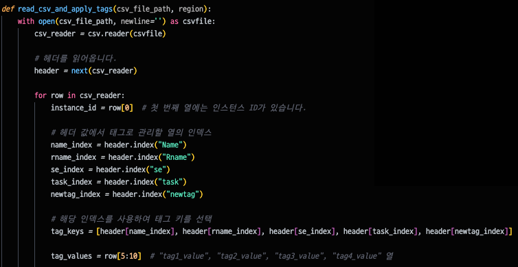

## Export EC2 Instances Info, Tags and Apply AWS

### Reference
[AWS : search-ec2-instances-export-tags](https://github.com/aws-samples/search-ec2-instances-export-tags/tree/main)

<br>

### 준비 사항

1. Python
2. Aws configure

```
$ aws configure
> Input access key, secret access key
```

<br>

### Description

EC2 정보와 Tag를 csv 파일로 추출하고, 추출한 csv 파일에서 각 인스턴스의 태그 정보를 직접 수정하여 실시간으로 aws에 반영할 수 있다.

- 가독성 있는 EC2 태그 현황
- 하나의 파일로 모든 인스턴스의 태그 관리
- Tag 값은 csv 파일 기준으로 관리 (apply 시, csv파일에 tag key가 없다면 aws에 존재하는 tag 값 삭제)

<br>

### Usage

1. EC2의 태그 정보를 추출할 Instance ID가 있는 Input 파일 생성

   ```
   aws ec2 describe-instances --filters --query "Reservations[].Instances[].InstanceId" --profile [aws configure profile]
   ```

   해당 cli로 Instance ID 조회

2. search_instance.py 실행

   ```
   python -m search_instances.py -i INPUTFILE -o OUTPUTFILE -r REGION [-p PROFILE]

   ex) python search_instances.py -i instance_list -o out.csv -r us-east-1
   ```

3. ec2_tag_apply_aws.py 실행
   ```
   python -m ec2_tag_apply_aws.py
   ```

<br>

### Custom

Inastance의 Tags[Key:Value] 수정 및 추가 시 ec2_tags_apply_aws.py에서 def read_csv_and_apply_tags 함수에서 아래 소스부분 수정


태그 key 변경 시 인덱스 명만 수정해주면 된다.

새로운 태그 추가 시, 새로운 태그의 key값을 인덱스에 추가해주고 tag_keys 리스트에 추가 및 tag_values = row[]의 범위만 늘려주면 된다.

row[5:10] = csv의 헤더 부분의 열(row) 범위
